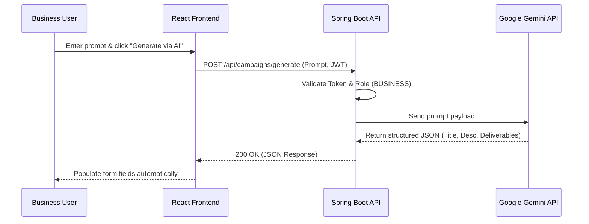
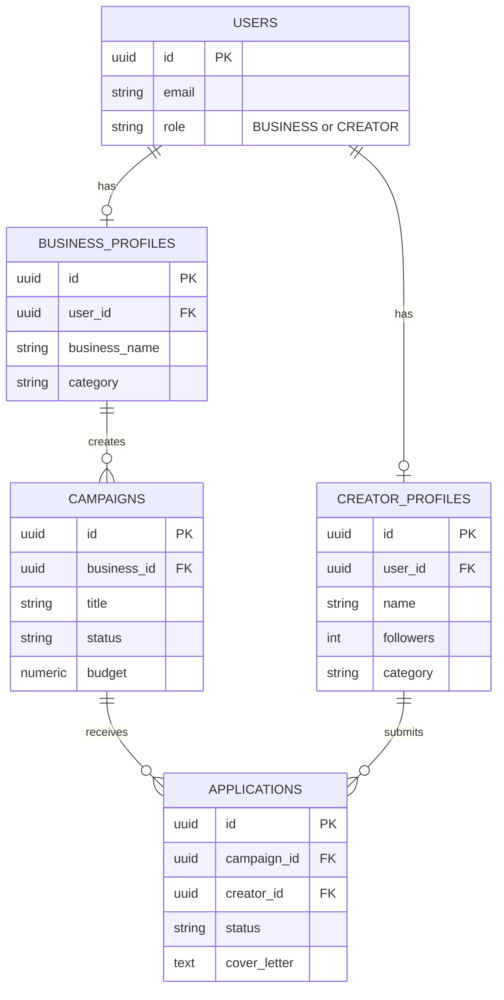

# PROJECT DOCUMENTATION
**Project Title:** Collably AI (PromoBridge) - AI-Powered Influencer Collaboration Marketplace

---

## Acknowledgement
I would like to express my profound gratitude to everyone who contributed to the successful completion of this project. Special thanks to the open-source communities behind Spring Boot, React, Supabase, and Google Gemini for providing the robust tools and frameworks that made this application possible. This project stands as a testament to modern web development practices and the power of artificial intelligence in solving real-world business challenges.

## Declaration
I hereby declare that the project entitled "Collably AI (PromoBridge)" is an original piece of work. The system architecture, software implementation, and documentation are developed following industry-standard software engineering principles. References to external libraries, frameworks, and APIs have been duly acknowledged where applicable.

---

## Abstract
Influencer marketing has become a cornerstone of digital advertising, yet the process of discovering creators, negotiating rates, and managing campaigns remains fragmented and inefficient. **Collably AI (PromoBridge)** is a comprehensive, AI-driven two-sided marketplace designed to bridge the gap between businesses and content creators. 

Built using a modern technology stack—React 19 (Frontend), Spring Boot 3 (Backend), Supabase PostgreSQL (Database), and Google Gemini AI—the platform offers a seamless ecosystem. Businesses can leverage Generative AI to instantly draft structured campaign proposals, browse a live database of vetted creators, and track applications. Conversely, creators are provided with a dedicated suite to discover sponsorship opportunities, submit tailored proposals, and manage their portfolios. By centralizing these operations and enforcing strict role-based access control, PromoBridge significantly reduces friction, fostering transparent and high-ROI collaborations.

---

## Chapter 1: Introduction

### 1.1 Overview
Collably AI is a web-based platform that facilitates end-to-end influencer marketing campaigns. It provides tailored interfaces for two distinct user roles: **Businesses** (brands/agencies looking for promotion) and **Creators** (influencers seeking sponsorships). The application integrates modern UI/UX design with robust backend processing and AI capabilities.

### 1.2 Motivation
The creator economy is booming, but small to medium-sized businesses often lack the resources to identify the right influencers. Simultaneously, micro and mid-tier creators struggle to find legitimate brand deals outside of direct messages. The motivation behind PromoBridge is to democratize influencer marketing by providing an accessible, automated, and secure platform for both parties.

### 1.3 Objectives
- To develop a scalable, two-sided marketplace for brands and influencers.
- To integrate Generative AI (Google Gemini) to assist businesses in drafting comprehensive campaign requirements.
- To provide advanced discovery and filtering tools for finding suitable creators based on niche, location, and audience size.
- To ensure data integrity and security through strict Role-Based Access Control (RBAC) and OAuth2 authentication.

### 1.4 Existing System
Currently, brands rely on fragmented systems:
- Manual outreach via Instagram/Twitter DMs or emails.
- Expensive, enterprise-only influencer platforms that isolate small businesses.
- Manual drafting of campaign requirements and legal deliverables using Word or Google Docs.
- Tracking applications and payments through disparate Excel spreadsheets.

### 1.5 Proposed System
PromoBridge replaces the existing fragmentation with a unified system:
- **Centralized Hub:** A single platform for discovery, application, and management.
- **AI-Assisted Workflows:** Automated generation of campaign titles, deliverables, and budgets.
- **Role Isolation:** Strict separation of Business and Creator environments to ensure data privacy and focused user experiences.
- **Real-Time Data:** Live database queries for creator metrics (followers, engagement) and campaign statuses.

---

## Chapter 2: Literature Review
The shift towards influencer marketing over traditional advertising has been heavily documented. Platforms like Upfluence and Grin dominate the enterprise space but often feature steep learning curves and high costs. Recent studies indicate that AI integration in marketing platforms can reduce campaign setup time by over 40%. PromoBridge builds upon these findings by offering a lightweight, AI-first alternative tailored for rapid deployment and ease of use, utilizing the latest web technologies (React 19, Java 21) to ensure future-proof performance.

---

## Chapter 3: Problem Statement
"How can we create a streamlined, secure, and intelligent platform that connects businesses with content creators, automates the campaign creation process, and manages the entire collaboration lifecycle without relying on fragmented, manual communication channels?"

---

## Chapter 4: System Requirements & Technologies

### 4.1 Hardware Requirements
- **Server:** Minimum 2 vCPUs, 4GB RAM (Cloud-hosted via Render/AWS).
- **Database:** Managed PostgreSQL instance (Supabase).
- **Client:** Modern web browser (Chrome, Safari, Firefox, Edge).

### 4.2 Software & Technology Stack
- **Frontend Core:** React 19, TypeScript, Vite
- **Frontend UI/UX:** Tailwind CSS, Framer Motion, Lucide Icons
- **Backend Core:** Java 21, Spring Boot 3.2.x
- **Database & ORM:** PostgreSQL 16 (Supabase Session Pooler), Hibernate JPA, Flyway (Migrations)
- **AI Integration:** Google Gemini API (Flash/Pro Models)
- **Authentication:** Clerk (JWT OAuth2 Resource Server)
- **Deployment:** Vercel (Frontend), Render (Backend), GitHub Actions (CI/CD)

---

## Chapter 5: Design & Architecture

### 5.1 System Architecture
PromoBridge employs a decoupled, RESTful microservice architecture. The React frontend communicates asynchronously with the Spring Boot backend via secure HTTP requests. Authentication is handled statelessly via Clerk JWTs.

### 5.2 UML Diagrams

#### 5.2.1 Use Case Diagram
```mermaid
usecaseDiagram
    actor Business as "Business User"
    actor Creator as "Creator User"
    
    package "Collably AI (PromoBridge)" {
        usecase "Authenticate (Login/Signup)" as UC1
        usecase "Select Permanent Role" as UC2
        
        usecase "Generate Campaign via AI" as UC3
        usecase "Publish Campaign" as UC4
        usecase "Discover Creators" as UC5
        usecase "Manage Applications" as UC6
        
        usecase "Browse Sponsorships" as UC7
        usecase "Submit Application" as UC8
        usecase "Manage Creator Profile" as UC9
    }
    
    Business --> UC1
    Creator --> UC1
    Business --> UC2
    Creator --> UC2
    
    Business --> UC3
    Business --> UC4
    Business --> UC5
    Business --> UC6
    
    Creator --> UC7
    Creator --> UC8
    Creator --> UC9
```

#### 5.2.2 Sequence Diagram: AI Campaign Generation


#### 5.2.3 Entity Relationship (ER) Diagram


---

## Chapter 6: Implementation

### 6.1 Backend Implementation
- **RESTful Endpoints:** Controllers mapped to `/api/public`, `/api/discovery`, and protected routes `/api/campaigns`, `/api/applications`.
- **Security Configuration:** `SecurityConfig.java` enforces JWT validation using Spring Security OAuth2. Public discovery routes are permitted, while state-mutating endpoints require valid Bearer tokens.
- **AI Service:** The `GeminiAIService` constructs prompts and parses JSON responses from Google's LLM, converting natural language into structured `CampaignDTO` objects.

### 6.2 Frontend Implementation
- **Dynamic Routing:** `react-router-dom` manages navigation. A global `DashboardLayout` dynamically adjusts navigation links based on the user's permanent role (`businessNav` vs `creatorNav`).
- **State Management:** React Hooks (`useState`, `useEffect`) manage local component state, while Context/LocalStorage caches the user's role to prevent UI flickering.
- **API Client:** An Axios instance intercepts outgoing requests to automatically append the Clerk JWT `Authorization` header.

---

## Chapter 7: Software Testing

### 7.1 Unit Testing
- **Backend:** JUnit 5 and Mockito are used to test business logic within Services, mocking repository responses to ensure data manipulation is accurate without database dependency.
- **Frontend:** TypeScript provides static type checking (`npx tsc -b`) to ensure DTO interfaces match backend responses perfectly, eliminating runtime type errors.

### 7.2 Integration Testing
- Tested the end-to-end flow of Campaign Creation -> Database Persistence -> API Retrieval -> UI Display.
- Verified that CORS policies allow the Vercel frontend to communicate seamlessly with the Render backend.

### 7.3 Security Testing
- Verified RBAC: Attempting to access `/api/campaigns` via POST with a `CREATOR` role JWT successfully returns `403 Forbidden`.
- Verified Route Guards: Frontend automatically redirects Creators attempting to load `/dashboard/campaigns/new`.

---

## Chapter 8: Results
The deployed application successfully meets all objectives:
- **Zero-Friction Onboarding:** Users seamlessly authenticate via Clerk and permanently select their workspace.
- **High-Performance UI:** React 19 and Vite deliver near-instant page transitions, complemented by Framer Motion micro-animations.
- **Data Integrity:** The Supabase PostgreSQL database accurately stores and serves 100+ seeded creator profiles and active campaigns through efficient Pageable API queries.
- **Successful AI Integration:** The Gemini AI module reliably interprets vague user prompts (e.g., "Need a tech influencer for a 3-day gadget launch") into formal, structured campaign briefs.

---

## Chapter 9: Conclusion & Future Enhancements

### 9.1 Conclusion
Collably AI (PromoBridge) represents a modernized approach to influencer marketing. By combining an intuitive, role-isolated user interface with a robust, secure Spring Boot backend and cutting-edge Generative AI, the platform successfully solves the problem of fragmentation in the creator economy. It empowers businesses to launch campaigns faster and creators to find legitimate work safely.

### 9.2 Future Enhancements
- **Payment Gateway Integration:** Integrate Stripe to handle escrow payments between businesses and creators directly on the platform.
- **In-App Messaging & Contracts:** Implement WebSockets for real-time chat and digital signature capabilities for campaign contracts.
- **Advanced Analytics Dashboard:** Incorporate real-time social media API webhooks to track actual post engagement (likes, views) automatically once a campaign is live.

---

## Chapter 10: Bibliography
1. Spring Boot Documentation. (n.d.). Retrieved from https://spring.io/projects/spring-boot
2. React - A JavaScript library for building user interfaces. (n.d.). Retrieved from https://react.dev/
3. PostgreSQL: The World's Most Advanced Open Source Relational Database. (n.d.). Retrieved from https://www.postgresql.org/
4. Google Gemini API Documentation. (n.d.). Retrieved from https://ai.google.dev/
5. Clerk Authentication. (n.d.). Retrieved from https://clerk.com/docs
6. Tailwind CSS Framework. (n.d.). Retrieved from https://tailwindcss.com/
