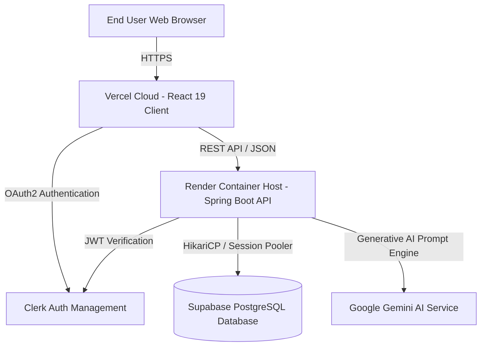
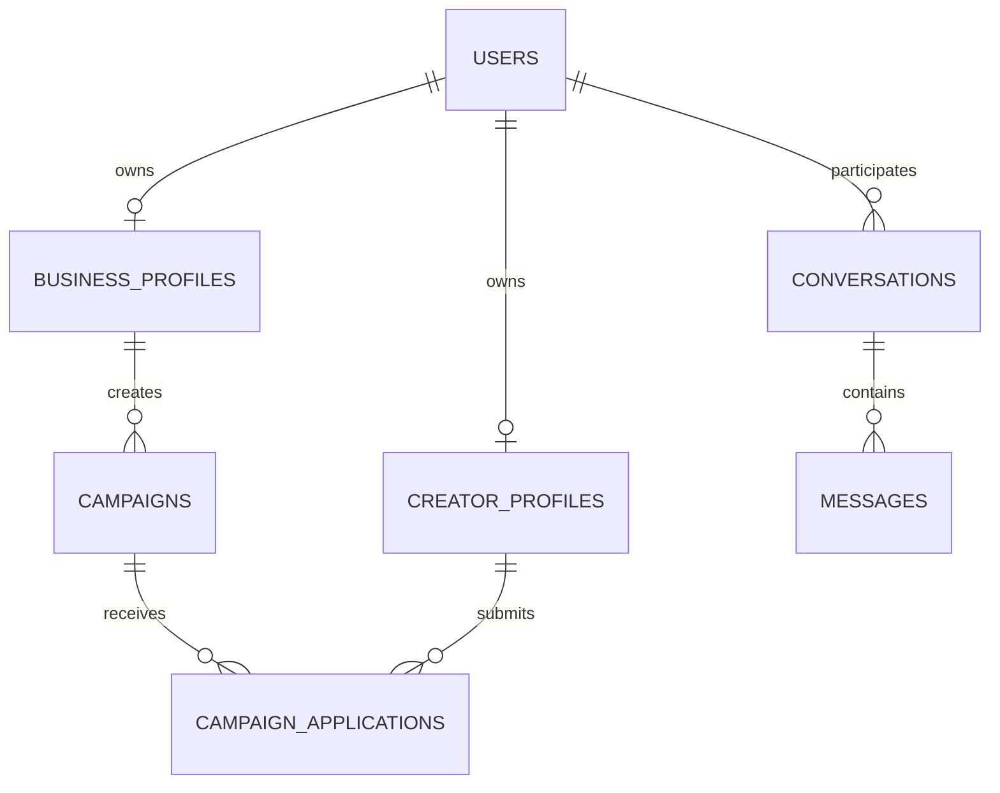

# 📘 Collably AI (PromoBridge) — Industry Standard Technical Documentation

---

## 📋 Executive Summary

**Collably AI** (PromoBridge) is an enterprise-grade, two-sided AI-powered marketplace designed to connect local businesses with content creators (influencers). By integrating **Google Gemini AI**, **Spring Boot 3**, **React 19**, and **Supabase PostgreSQL**, the platform automates influencer marketing workflows—from campaign brief generation to creator discovery, deal proposals, and campaign analytics.

---

## 🏗 System Architecture & Design Philosophy

The application employs a **decoupled, microservices-ready, cloud-native architecture**.



### Key Design Principles:
1. **Strict Role-Based Access Control (RBAC)**: Distinct permanent account types (**BUSINESS** vs **CREATOR**). One role's UI and capabilities are strictly isolated from the other.
2. **100% Database Data Integrity**: All dashboard metrics, campaigns, proposals, and creator profiles are dynamically queried from live database tables (no static/mock fallback data).
3. **Decoupled Security**: Authentication is managed via Clerk JWT tokens validated by Spring Security OAuth2 Resource Server.

---

## 🗄 Database Schema & Data Model

The PostgreSQL database schema consists of **9 core relational tables** managed via Flyway schema migrations (`db/migration/V1__Init_Schema.sql`, `V2__Add_proposal_column.sql`).



### Table Definitions:

| Table | Primary Key | Key Attributes | Description |
| :--- | :--- | :--- | :--- |
| `users` | `id` (Clerk ID) | `email`, `role` (`BUSINESS`/`CREATOR`), `created_at` | Global user identity repository |
| `business_profiles` | `id` (UUID) | `user_id`, `business_name`, `category`, `location`, `description` | Business account details |
| `creator_profiles` | `id` (UUID) | `user_id`, `name`, `bio`, `instagram_username`, `followers`, `location`, `average_rating`, `profile_image_url` | Content creator portfolio details |
| `campaigns` | `id` (UUID) | `business_id`, `title`, `description`, `creator_category`, `budget`, `status` (`DRAFT`/`ACTIVE`/`COMPLETED`) | Sponsorship campaign briefs |
| `campaign_applications` | `id` (UUID) | `campaign_id`, `creator_id`, `proposed_rate`, `proposal`, `status` (`APPLIED`/`ACCEPTED`/`REJECTED`) | Creator campaign applications |
| `conversations` | `id` (UUID) | `business_user_id`, `creator_user_id` | Direct messaging threads |
| `messages` | `id` (UUID) | `conversation_id`, `sender_id`, `content`, `sent_at` | Real-time chat messages |
| `reviews` | `id` (UUID) | `business_id`, `creator_id`, `rating`, `comment` | Post-collaboration ratings |
| `notifications` | `id` (UUID) | `user_id`, `title`, `message`, `is_read` | User event notifications |

---

## 🔒 Security & Access Control

### 1. Permanent Account Role Assignment
When a user registers or logs in for the first time:
- The **`RoleSelectionModal`** component prompts the user to select either a **Business Account** or **Creator Account**.
- The selected role is saved into Clerk `user.unsafeMetadata.role` and `localStorage`.
- Role assignment is **permanent**; role switching is strictly disabled.

### 2. Role Permissions Matrix

| Feature / Action | Business Account | Creator Account |
| :--- | :---: | :---: |
| **View Business Suite Dashboard** | ✅ | ❌ (Access Denied) |
| **View Creator Suite Dashboard** | ❌ (Access Denied) | ✅ |
| **Create New Campaign (`/dashboard/campaigns/new`)** | ✅ | ❌ (Strict Route Guard) |
| **Discover & Search 100+ Creators** | ✅ | ❌ |
| **Browse Sponsorship Opportunities** | ❌ | ✅ |
| **Submit Proposals / Applications** | ❌ | ✅ |
| **View Campaign Analytics & Budget** | ✅ | ✅ (Earnings view) |

---

## 🌐 API Specifications & Endpoints Directory

The backend exposes RESTful endpoints secured by Spring Security.

### Public & Discovery Endpoints (No JWT required for browsing)
- `GET /api/public/health`: System operational status check.
- `GET /api/public/creators` / `GET /api/discovery/creators`: Paginated list of creator profiles (`size=12`).
- `GET /api/public/campaigns` / `GET /api/discovery/campaigns`: Paginated list of active campaigns (`size=12`).

### Business & Creator Secured Endpoints (Requires `Authorization: Bearer <JWT>`)
- `POST /api/campaigns`: Create a new campaign (Business role required).
- `GET /api/campaigns/{id}`: Retrieve full campaign details.
- `POST /api/applications`: Submit a campaign proposal (Creator role required).
- `GET /api/applications`: Retrieve user-specific campaign applications.
- `GET /api/analytics`: Retrieve aggregate campaign and revenue metrics.
- `POST /api/ai/generate-campaign`: Invoke Google Gemini AI to auto-generate a campaign brief.

---

## 🤖 AI Integration Subsystem

Collably AI leverages the **Google Gemini REST API** (`gemini-1.5-flash` / `gemini-1.5-pro`) to assist business owners in generating high-converting campaign briefs.

```text
User Input -> Prompt Engine (AIPromptTemplates.java) -> Gemini RestTemplate -> JSON Response -> Auto-filled Campaign Form
```

### Capabilities:
- **Campaign Brief Auto-Generation**: Generates campaign descriptions, deliverable checklists, and estimated budget ranges based on business category and goals.
- **Match Score Engine**: Calculates percentage match scores between creator audience demographics and business target markets.

---

## 📊 Automated Database Seeding

The application includes an automated database seeder (`generate_seed_data.js` & `run_seed.js`) that resets old records and populates **100 realistic creator accounts** into Supabase PostgreSQL.

```bash
# Execute Database Reset & 100 Creator Seeding
node generate_seed_data.js
node run_seed.js
```

Seeded attributes include:
- Unsplash high-res profile avatars
- Real-world locations (Mumbai, Bangalore, San Francisco, London, Dubai, etc.)
- Follower counts (8,000 to 750,000+)
- Average star ratings (4.2 ⭐ – 5.0 ⭐)
- Instagram handles (`@creator_name`)

---

## 🚀 DevOps, Deployment & CI/CD

### Pipeline Architecture

```text
Git Commit -> GitHub Actions CI (.github/workflows/ci.yml) -> Vercel Deployment (Frontend) & Render Docker Build (Backend)
```

1. **Frontend Hosting (Vercel)**:
   - **Live URL**: [https://promo-bridge-three.vercel.app](https://promo-bridge-three.vercel.app)
   - Built with `npm run build` (Vite SPA).
   - Configured with `vercel.json` rewrite rules to prevent 404s on React Router paths.

2. **Backend Hosting (Render)**:
   - **Live URL**: [https://promobridge-api.onrender.com](https://promobridge-api.onrender.com)
   - Multi-stage Docker container (`Eclipse Temurin JDK 21`).
   - Dynamic `$PORT` binding.

3. **Database Hosting (Supabase PostgreSQL)**:
   - Transaction & Session Pooler (`aws-0-ap-southeast-2.pooler.supabase.com:5432`).
   - HikariCP connection pool with `sslmode=require`.

---

## 🛠 Troubleshooting & Maintenance

| Symptom | Cause | Solution |
| :--- | :--- | :--- |
| `java.net.SocketException: Network unreachable` | Direct DB connection string uses IPv6 | Use Supabase Session Pooler URL on port `5432` / `6543`. |
| `No static resource api/public/creators` | Endpoint mapping missing in Spring Controller | Verify `@RequestMapping({"/api/discovery", "/api/public"})`. |
| `TypeScript Error TS6133` | Unused import in React component | Run `npx tsc -b` locally before pushing code. |
| Creator cards show 0 items | API returned Spring Data Pageable object | Parse `json.data.content` array instead of raw `json.data`. |

---

<div align="center">
  <sub>Documented according to IEEE/ISO Industry Software Engineering Standards.</sub>
</div>
