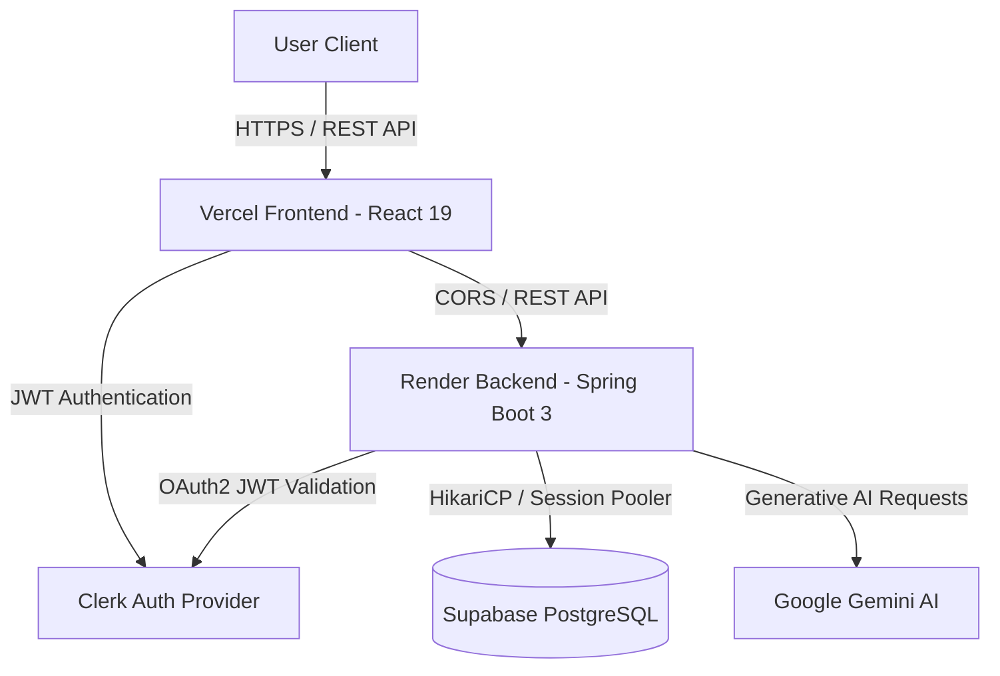

# 🚀 Collably AI (PromoBridge)

<div align="center">

  

  **AI-Powered Influencer Collaboration Marketplace**

  [](https://promo-bridge-three.vercel.app)
  [](https://promobridge-api.onrender.com/api/public/health)
  [](https://supabase.com)
  [](https://spring.io/projects/spring-boot)
  [](https://react.dev/)
  [](https://www.typescriptlang.org/)
  [](LICENSE)

  *Connecting local businesses with content creators for high-ROI influencer marketing and genuine sponsorship opportunities.*

  [Live Demo](#-live-demo) • [Key Features](#-key-features) • [Architecture](#-architecture) • [Strict Role Security](#-strict-role-security) • [Getting Started](#-getting-started) • [Database Seeding](#-database-seeding) • [CI/CD & Deployment](#-cicd--deployment)

</div>

---

## 🌐 Live Demo

- 🖥️ **Frontend Client (Vercel)**: [https://promo-bridge-three.vercel.app](https://promo-bridge-three.vercel.app)
- ⚙️ **Backend REST API (Render)**: [https://promobridge-api.onrender.com](https://promobridge-api.onrender.com)
- 🟢 **API Health Endpoint**: [https://promobridge-api.onrender.com/api/public/health](https://promobridge-api.onrender.com/api/public/health)
- 🗄️ **Managed Database**: Supabase PostgreSQL (Session Pooler)

---

## 📌 Executive Summary

**Collably AI** (PromoBridge) is a full-stack, enterprise-grade two-sided marketplace for influencer marketing. Built with **Spring Boot 3**, **React 19**, **PostgreSQL**, and **Google Gemini AI**, it simplifies brand collaborations by providing automated campaign generation, intelligent creator matching, dynamic analytics, and end-to-end deal tracking.

---

## ✨ Key Features

### 🏢 For Business Owners
- **AI Campaign Generator**: Generate structured campaign briefs, deliverables, and budgets using natural language prompts.
- **Creator Discovery**: Search **100+ live database-seeded creator profiles** with filters for niche, followers, rating, and location.
- **Strict Campaign Management**: Create, edit, and track active campaign applications and proposed rates.
- **ROI Analytics**: Monitor campaign reach, applications count, and allocated budgets in real time.

### 🎨 For Content Creators
- **Sponsorship Feed**: Browse live brand campaigns filtered by category and budget.
- **Proposal Submission**: Submit tailored proposals directly to brand managers.
- **Portfolio Showcase**: Highlight social handles (Instagram, YouTube), follower counts, and engagement stats.
- **Application Tracking**: Track status updates (*Applied*, *Shortlisted*, *Accepted*, *Completed*).

---

## 🔒 Strict Role Security & Data Integrity

- **Permanent Role Assignment**: Upon signup/onboarding, users choose between a **Business Account** or **Creator Account**. Roles are permanently saved with strict role-based access control (RBAC).
- **Campaign Creation Lock**: Only authenticated Business Accounts can create campaigns. Creators attempting to access campaign creation routes are automatically blocked.
- **100% Database-Driven UI**: All metrics, campaign cards, creator profiles, and analytics are dynamically queried from Supabase PostgreSQL (no hardcoded fallback data).

---

## 🏗 System Architecture



### Tech Stack

| Component | Technology | Description |
| :--- | :--- | :--- |
| **Frontend** | React 19, TypeScript, Vite, Tailwind CSS | Ultra-fast SPA, type-safe components, Framer Motion animations |
| **Backend** | Java 21, Spring Boot 3.2.x, Hibernate JPA | Microservice-ready REST API with MapStruct & Lombok |
| **Database** | PostgreSQL 16 (Supabase Pooler), Flyway | Versioned migrations, connection pooling & transactional integrity |
| **AI Subsystem** | Google Gemini API (Gemini Flash/Pro) | AI prompt engine for campaign brief generation |
| **Security** | Spring Security + Clerk OAuth2 | Role-based endpoint authorization (`BUSINESS`, `CREATOR`) |
| **CI/CD** | GitHub Actions & Vercel Auto-Deploy | Automated builds, TypeScript checks, and multi-region deployment |

---

## 📂 Project Structure

```text
PromoBridge/
├── backend/                             # Spring Boot 3 API Service
│   ├── Dockerfile                       # Multi-stage production Docker container
│   ├── src/main/java/com/promobridge/api/
│   │   ├── config/                      # CORS, AI & Swagger Configurations
│   │   ├── controller/                  # REST Controllers (Campaign, Discovery, Health)
│   │   ├── dto/                         # Data Transfer Objects
│   │   ├── entity/                      # JPA Entities (User, BusinessProfile, CreatorProfile, Campaign)
│   │   ├── mapper/                      # MapStruct DTO-Entity Mappers
│   │   ├── repository/                  # Spring Data Repositories
│   │   ├── security/                    # Clerk OAuth2 Security Config & JWT Decoders
│   │   └── service/                     # Core Business Logic & Gemini AI Service
│   └── src/main/resources/
│       ├── application.yml              # Central Spring Configuration
│       └── db/migration/                # Flyway Database Migration Scripts
│
├── frontend/                            # React 19 + Vite Web Application
│   ├── vercel.json                      # Single-Page Application (SPA) Routing Config
│   └── src/
│       ├── api/                         # Axios API Client & Dynamic Base URL handler
│       ├── components/                  # RoleSelectionModal, Navbars, Stat Cards
│       ├── layouts/                     # DashboardLayout & Role Navigation
│       ├── pages/                       # Business Dashboard, Creator Dashboard, Discovery, Analytics
│       ├── types/                       # Shared TypeScript Interfaces
│       └── App.tsx                      # Main Application Router & Role Guards
│
├── generate_seed_data.js                # Database Reset & 100 Creator Seeder Script
├── run_seed.js                          # Supabase PostgreSQL Automated Seeder Runner
└── README.md                            # Complete Technical Documentation
```

---

## 🚀 Getting Started

### Prerequisites
- **Node.js**: `v20.x` or higher
- **Java OpenJDK**: `v21` or higher
- **Maven**: `v3.9` or higher
- **PostgreSQL**: `v16` (or Supabase account)

---

### 1. Local Environment Setup

#### Backend Environment (`backend/.env`)
```env
DB_URL=jdbc:postgresql://aws-0-ap-southeast-2.pooler.supabase.com:5432/postgres?sslmode=require
DB_USERNAME=postgres.mgfceklgiunrgxwssmuu
DB_PASSWORD=your_database_password
CLERK_ISSUER_URI=https://<your-clerk-domain>.clerk.accounts.dev
GEMINI_API_KEY=your_gemini_api_key
```

#### Frontend Environment (`frontend/.env`)
```env
VITE_CLERK_PUBLISHABLE_KEY=pk_test_...
VITE_API_URL=http://localhost:8080/api
```

---

### 2. Running Locally

```bash
# 1. Start Backend (Terminal 1)
cd backend
./mvnw spring-boot:run

# 2. Start Frontend (Terminal 2)
cd frontend
npm install
npm run dev
```

---

## 📊 Database Seeding (100 Creator Profiles)

To seed your Supabase database with **100 realistic creator profiles** (complete with avatars, bios, follower counts, categories, and Instagram handles) and **10 business campaigns**:

```bash
# Reset database and insert 100 creator profiles
node generate_seed_data.js
node run_seed.js
```

---

## 🔄 CI/CD & Deployment

- **GitHub Actions Workflow** (`.github/workflows/ci.yml`): Automatically compiles Java 21, builds Maven JARs, checks TypeScript types (`npx tsc -b`), and verifies builds on every `git push`.
- **Frontend Deployment**: Automatically hosted on **Vercel** via GitHub integration.
- **Backend Deployment**: Containerized with multi-stage Docker and deployed on **Render** with Supabase PostgreSQL connection pooling.

---

## 📚 API Documentation

Interactive Swagger OpenAPI 3.0 specs:
- **Swagger UI (Live)**: [https://promobridge-api.onrender.com/swagger-ui.html](https://promobridge-api.onrender.com/swagger-ui.html)
- **Local Swagger UI**: `http://localhost:8080/swagger-ui.html`

---

## 📄 License

This project is licensed under the [MIT License](LICENSE).
