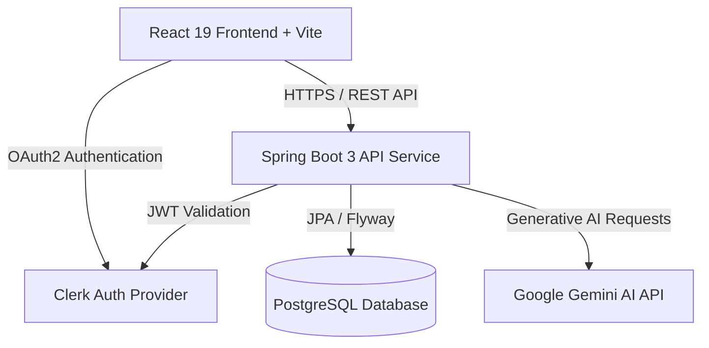

# 🚀 Collably AI (PromoBridge)

<div align="center">

  

  **AI-Powered Influencer Collaboration Marketplace**

  [](https://spring.io/projects/spring-boot)
  [](https://www.oracle.com/java/)
  [](https://react.dev/)
  [](https://www.typescriptlang.org/)
  [](https://www.postgresql.org/)
  [](https://tailwindcss.com/)
  [](LICENSE)

  *Helping local businesses find the right content creators and empowering creators to discover genuine sponsorship opportunities.*

  [Key Features](#-key-features) • [Architecture](#-architecture) • [Getting Started](#-getting-started) • [Database Seeding](#-database-seeding) • [API Documentation](#-api-documentation) • [Deployment](#-deployment)

</div>

---

## 📌 Executive Summary

**Collably AI** (PromoBridge) is a production-ready, full-stack two-sided marketplace designed for seamless business-creator collaborations. Built using Spring Boot 3, React 19, PostgreSQL, and Google Gemini AI, it eliminates friction in influencer marketing by offering automated AI campaign generation, intelligent creator matching, dynamic analytics, and end-to-end campaign tracking.

---

## ✨ Key Features

### 🏢 For Businesses
- **AI Campaign Generator**: Generate structured, high-converting campaign proposals, deliverables, and budgets using natural language prompts.
- **Creator Discovery & Smart Matching**: Search 100+ vetted creator profiles with filterable criteria (niche, location, follower count, engagement score).
- **Application Management**: Review incoming creator applications, accept/reject proposals, and track deliverables in real-time.
- **Performance Analytics**: Gain insights into ROI, total reach, active campaigns, and engagement metrics.

### 🎨 For Content Creators (Influencers)
- **Sponsorship Feed**: Discover genuine, verified campaign opportunities tailored to your niche and audience size.
- **1-Click Application**: Submit customizable proposals and proposed rates directly to business owners.
- **Creator Profile & Portfolio**: Showcase past collaborations, audience demographics, and social stats (Instagram, YouTube).
- **Direct Messaging**: Communicate directly with brand managers for smooth execution.

---

## 🏗 Architecture

Collably AI adopts a decoupled, microservice-ready architecture ensuring high availability, security, and low latency.



### Tech Stack

| Domain | Technology | Details |
| :--- | :--- | :--- |
| **Frontend Core** | React 19, TypeScript, Vite | Ultra-fast SPA development & strict type safety |
| **Frontend UI/UX** | Tailwind CSS, Framer Motion, Lucide Icons | Glassmorphic design system & dynamic micro-interactions |
| **Backend Core** | Java 21, Spring Boot 3.2.x | Enterprise RESTful Web API service |
| **Database & ORM** | PostgreSQL 16, Hibernate JPA, Flyway | Versioned database schema & relational data mapping |
| **AI Subsystem** | Google Gemini API (Gemini Flash/Pro) | AI proposal generation, content scoring & matchmaking |
| **Authentication** | Clerk (JWT OAuth2 Resource Server) | Role-based authorization (`BUSINESS`, `CREATOR`) |
| **API Spec & Testing**| OpenAPI 3 / Swagger UI | Live interactive API documentation |

---

## 📂 Project Structure

```text
PromoBridge/
├── backend/                             # Spring Boot 3 Application
│   ├── src/main/java/com/promobridge/api/
│   │   ├── config/                      # Web & CORS Security Configurations
│   │   ├── controller/                  # REST Controllers (Campaign, Creator, Business, Health)
│   │   ├── dto/                         # Request & Response DTOs
│   │   ├── entity/                      # JPA Entities (User, BusinessProfile, CreatorProfile, etc.)
│   │   ├── exception/                   # Centralized Global Exception Handler
│   │   ├── mapper/                      # MapStruct DTO-Entity Mappers
│   │   ├── repository/                  # Spring Data Repositories
│   │   ├── security/                    # Clerk OAuth2 Security Config & JWT Decoders
│   │   └── service/                     # Core Business Logic & AI Integration
│   └── src/main/resources/
│       ├── application.yml              # Central Spring Configuration
│       └── db/migration/                # Flyway DB Schema Migration Scripts
│
├── frontend/                            # React 19 + Vite Frontend Application
│   └── src/
│       ├── api/                         # Axios HTTP Client & Interceptors
│       ├── components/                  # UI Components (Navbar, Cards, Modals, Badges)
│       ├── layouts/                     # Dashboard & Public Navigation Layouts
│       ├── pages/                       # App Pages (Dashboard, Campaigns, Details, Discovery)
│       ├── types/                       # Shared TypeScript Interfaces
│       └── App.tsx                      # Main Application Router
│
├── generate_seed_data.js                # Dummy Data SQL Generator Script
├── run_seed.js                          # PostgreSQL Automatic Seeder Tool
└── README.md                            # Comprehensive Documentation
```

---

## 🚀 Getting Started

### Prerequisites

Ensure you have the following installed locally:
- **Node.js**: `v18.x` or higher
- **Java OpenJDK**: `v21` or higher
- **Maven**: `v3.9` or higher
- **PostgreSQL**: `v15` or higher (or a cloud provider like Supabase/Neon)

---

### 1. Environment Setup

#### Backend Configuration (`backend/.env`)
Create a `.env` file inside the `backend/` directory:

```env
# Database Credentials
DB_URL=jdbc:postgresql://localhost:5432/postgres
DB_USERNAME=postgres
DB_PASSWORD=your_password

# Authentication & AI
CLERK_ISSUER_URI=https://<your-clerk-domain>.clerk.accounts.dev
GEMINI_API_KEY=your_google_gemini_api_key
```

#### Frontend Configuration (`frontend/.env`)
Create a `.env` file inside the `frontend/` directory:

```env
VITE_CLERK_PUBLISHABLE_KEY=pk_test_...
VITE_API_URL=http://localhost:8080/api
```

---

### 2. Running the Backend Server

```bash
cd backend

# Compile project dependencies
./mvnw clean compile

# Start Spring Boot Server
./mvnw spring-boot:run
```
The API server will launch at `http://localhost:8080`.
Verify health status at: `http://localhost:8080/api/public/health`

---

### 3. Running the Frontend Application

```bash
cd frontend

# Install Node modules
npm install

# Start Vite development server
npm run dev
```
Access the web client at `http://localhost:5173`.

---

## 📊 Database Seeding

The repository includes an automated data generator that populates **100 Business Accounts** and **100 Creator Accounts** into your PostgreSQL database.

```bash
# Generate seed SQL & insert 200 dummy profiles into PostgreSQL
node generate_seed_data.js
node run_seed.js
```

---

## 📚 API Documentation

Interactive OpenAPI 3.0 documentation is built directly into the Spring Boot backend.

- **Swagger UI**: [http://localhost:8080/swagger-ui.html](http://localhost:8080/swagger-ui.html)
- **OpenAPI JSON**: `http://localhost:8080/v3/api-docs`

---

## 🧪 Testing

### Backend Unit & Integration Tests
```bash
cd backend
./mvnw test
```

### Frontend Type Verification
```bash
cd frontend
npx tsc --noEmit
```

---

## 🌐 Deployment Guide

### Deploying Backend (Docker / Render / Railway)
1. Build executable JAR:
   ```bash
   cd backend && ./mvnw clean package -DskipTests
   ```
2. Execute JAR file:
   ```bash
   java -jar target/api-0.0.1-SNAPSHOT.jar
   ```

### Deploying Frontend (Vercel / Netlify)
1. Set Build Command: `npm run build`
2. Set Output Directory: `dist`
3. Configure environment variables (`VITE_CLERK_PUBLISHABLE_KEY`, `VITE_API_URL`).

---

## 📄 License

This project is open source and available under the [MIT License](LICENSE).
